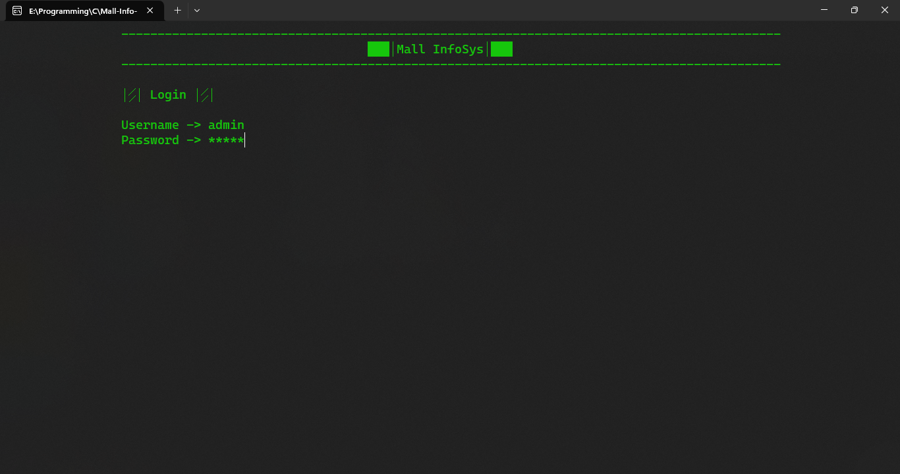
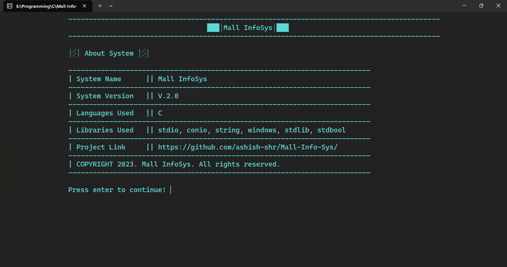

# 🏬Mall Information System

The Mall Information System, developed using C programming, aims to streamline mall operations and improve user experience.
By implementing this console-based application, we can enhance store management, item management, and employee management.

## 🪶Key Features

- Mall Administration
- Store, Item, Employee, and User Management
- Information Display
- Backup and Recovery
- Reset and Trash
- Scalability and Flexibility








## 🎯Objective and Benefits

- To develop a console-based application to manage and streamline mall operations.
- Design and develop a comprehensive system to manage mall operations using C programming.
- Provide real-time information about stores, events, and facilities to customers.
- Simplify administrative tasks and improve efficiency.
- Improved efficiency in-store management, enhanced customer experience, and increased revenue.

## 🧊System Architecture

- User Interface: Console-based interface for users and administrators.
- Database: Store and retrieve data using file handling in C.
- Logic: Implement functionality and operations in C programming language.

## ⚙️Technology Used

- Programming Language: C
- Standard Libraries: Loops, standard IO
- Boolean Libraries: For validation
- Windows Libraries: To change the console color and clear the screen
- Structure: Store block data
- File Handling: Read and write data to files in C.

## ⛏️Challenges

- User Interface
- Data Management
- Error Handling
- Accessibility

## 🏃‍♂️Installation

- First setup your environment then clone the following repo

```bash
  git clone https://github.com/ashish-shr/Mall-Info-Sys.git
```

- Compile the main.c before running
